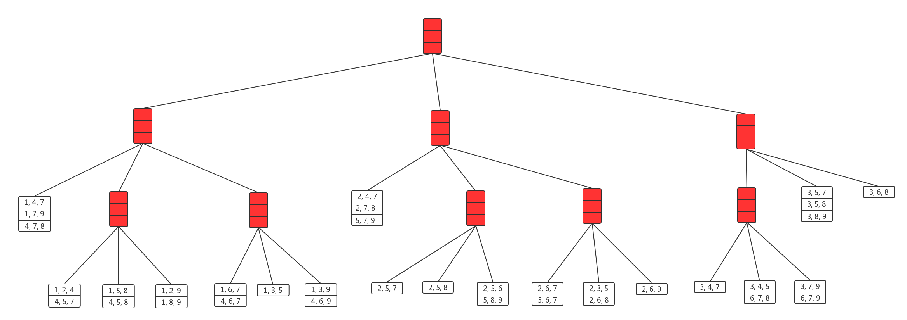
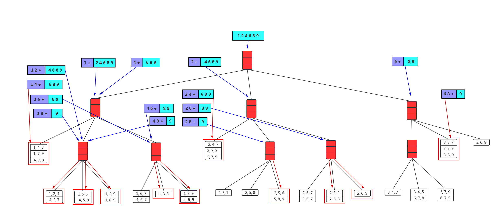

#MSC-BDT5002, Fall 2018

#Knowledge Discovery and Data Mining

#Answers to Assignment 1

##Q1. Hash Tree

#### Part A:

	Source code is under folder *A1_llingab_20527456_Q1_code*

* **The nested list of hash tree:**

  [[[[1, 4, 7], [1, 7, 9], [4, 7, 8]], [[[1, 2, 4], [4, 5, 7]], [[1, 5, 8], [4, 5, 8]], [[1, 2, 9], [1, 8, 9]]], [[[1, 6, 7], [4, 6, 7]], [[1, 3, 5]], [[1, 3, 9], [4, 6, 9]]]], [[[2, 4, 7], [2, 7, 8], [5, 7, 9]], [[[2, 5, 7]], [[2, 5, 8]], [[2, 5, 6], [5, 8, 9]]], [[[2, 6, 7], [5, 6, 7]], [[2, 3, 5], [2, 6, 8]], [[2, 6, 9]]]], [[[[3, 4, 7]], [[3, 4, 5], [6, 7, 8]], [[3, 7, 9], [6, 7, 9]]], [[3, 5, 7], [3, 5, 8], [3, 8, 9]], [[3, 6, 8]]]]

* **The structure of hash tree:**

  

#### Part B:

	Sum up the number of all subsets in selected packages, and the final result is **23**.

## Q2. FP-Tree

All source code is under folder *A1_llingab_20527456_Q2_code*/

#### Part A:

Outputs of Frequent item sets are stored in file *A1_llingab_20527456_Q2_code/frequent_groceries.csv*

#### Part B:

There 11 conditional fp-trees, if you want to see each cond. fp-trees base, the optional parameter is given in related output function.

	